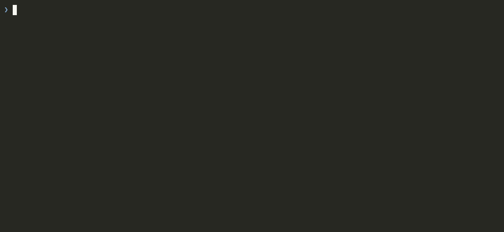

# casm

**Multi-node coding-agent session manager (claude code / opencode / pi) over SSH and Docker.**

List, search, and resume sessions for **Claude Code** (`cc`), **opencode** (`oc`), and **pi** (`pi`) - on this machine, over SSH, or in a container.
**Move sessions between machines over SSH** so you can continue them where you're working.
Sessions are agent-scoped: a session always moves to the *same* agent on the other machine, never across agents.

No npm dependencies. Node 18+. macOS and Linux.

## Install

**On every machine you want to manage** - casm talks to its own copy on the other end, so it has to be installed and on PATH everywhere.

```sh
npm i -g casm-cli        # installs the `casm` command
```

---

## Continue from anywhere

`casm continue` lists your 10 most recent sessions across all three agents,
newest first, with age, agent, project, context size and opening message. Pick a
number and casm changes into that session's own directory and hands the terminal
to its agent, resuming **by id** so you land in the session you picked rather
than whatever was newest in that folder.


```sh
casm continue                   # the 10 most recent, pick one
casm continue --agent opencode  # one agent only
casm continue --host rig        # or on another machine entirely
```

The picker covers this machine, containerized sessions included, and resumes
each one where it belongs. Configured ssh hosts are left out, since `continue`
ends by handing over your terminal; reach one with `--host`.

Bookmarks are pinned above the rest under a `bookmarks` header, with a `★`.
Enter takes the first, `q` aborts. If the original directory is gone it says so
and starts where you are.

## Search and resume

Full-text search across every transcript, every agent and every machine, with
the matching line shown in context. Then resume the hit wherever it lives.


```sh
casm search "rate limiting"       # every agent, every machine
casm search "flaky test" --agent claude
casm show 019e4ee3 -n 20          # read it first
casm resume 019e4ee3              # ...then pick it up
```

Ids can be abbreviated anywhere to a unique prefix, and a bookmark alias works
in every place an id does.

## See what every machine is doing

Which agents are running, on which machine or container, in which project, and
whether they are working or waiting on you.

```sh
casm active                     # this machine + every configured host
casm active --local             # just here
```

Statuses are inferred from each agent's own transcript: `generating`,
`running tool`, `waiting approval?`, `working`, `stalled?`, `idle`. The one
worth watching for is `waiting approval?` - an agent that has been sitting on a
permission prompt while you were somewhere else.

## Move a session between machines

Start something on the laptop, finish it on the workstation. The session keeps
its id and its full history; only the project path is adjusted for the target.

```sh
casm push c66fbd0b rig          # interactive: casm finds the project over there
casm push c66fbd0b rig --to /home/me/proj
casm pull rig                   # what is on rig?
casm pull rig c66fbd0b          # bring one back
```

Sessions are agent-scoped: claude to claude, opencode to opencode, pi to pi,
detected from the id with no flag needed. Both copies then exist under the same
id and drift apart independently, so `casm show` prints an `also on <host>` line
for every other machine holding it.

## Bypass permission prompts, in a dedicated container

Agents ask permission constantly, and turning that off on your own machine means
an agent with your shell and your home directory. `casm containerize` moves a
session into a dedicated container: prompts off inside, where the only thing it
can reach is the project you pointed it at.



```sh
casm containerize c66fbd0b     # move a session you already started into one
casm new --containerized       # or start a fresh session already inside one
```

That is the whole interface. There is no container to name, create, start,
authenticate or clean up.

**The session is still yours.** Its transcripts live on this machine, not inside
the container, so `casm list`, `casm search` and `casm show` read it exactly as
before and `casm continue` offers it alongside everything else, with a `▣`
beside the project. Only resuming goes into the container.

**Containerizing is one-way.** The transcript moves rather than copies, so there
is no second copy to drift apart, and no route back that would quietly resume a
prompts-off session with prompts on.

**The container is disposable, the session is not.** Delete it with `docker rm`
whenever you want the disk back. The next resume rebuilds it from what casm
recorded, on the same published ports, and re-runs the setup script the agent
kept while it worked. The agent is told it is in a container that can be reset,
and to record anything it installs there.

**One session, one container.** The environment an agent builds - packages it
installed, a database it started - is part of that conversation and lasts
exactly as long as it does.

### What the agent can reach

The project directory, mounted read-write at its own path, so `~` and every path
in the transcript mean the same thing inside and out and nothing needs
translating. Your agent config comes along read-only. The rest of your home does
not come along at all.

**That project directory is the blast radius.** Permissions are off in there and
sudo needs no password, so the agent can write all of it. Pick it deliberately -
pointing it at `~` mounts your whole home read-write.

Credentials are copied in rather than mounted, and always without the refresh
token, so a container can use your login but can never rotate the one your host
depends on. casm tops them up each time you resume.

Five ports from 20000 up are published unchanged, so a dev server the agent
starts on 20000 is on 20000 for you too. `CASM_PORTS` and `PORT` are set inside
so the agent knows its range without being told. `--ports N` resizes and
`--no-ports` opts out.

---

## Targets

A target is anywhere casm can run:

| | |
|---|---|
| `local` | this machine |
| `<ssh-target>` | a machine: a `~/.ssh/config` name, or `user@host` |

Usernames, ports, identity files and jump hosts belong in `~/.ssh/config`.

```sh
casm host add rig                # adds it, then checks ssh + casm on the far end
casm host list                   # every host: ready / no casm / unreachable
casm host rm rig
```

Containers are not targets. A containerized session is reached by its own id
wherever you are, and casm knows which container it belongs to.

Hosts are a plain list in `~/.config/casm/config.json`, with the containerized
sessions recorded beside them.

## All commands

```sh
casm continue                  # pick from your 10 most recent sessions here or in a container
casm new                       # start a new session (--agent, --host, --dir)
casm new --containerized       # ...in a dedicated container
casm containerize 019e4ee3     # move an existing session into one (one-way)
casm search "rate limiting"    # full-text search across agents and machines
casm resume 019e4ee3           # resume by id, in its own directory and its own agent
casm resume 019e4ee3 --host rig  # resume it on another machine
casm active                    # list currently active sessions from all nodes
casm list -n 30                # newest sessions across all agents and machines
casm list --agent opencode     # one agent only
casm show ses_110bdd           # preview a session, here or on any host (agent auto-detected)
casm host list                 # configured hosts + their reachability
```

`continue`, `resume` and `new` take `--host`, as do `list`, `search`, `active`
and `show`.

`active`, `list` and `search` cover this machine and every configured host;
scope them with `--local` or `--host <name>`. `continue` covers this machine
only, since it ends by handing your terminal over.

## Bookmarks

Pin the sessions you intend to come back to:

```sh
casm bookmark 19dc764f casm-work   # bookmark with an alias (casm bm works too)
casm bookmark fc1cbe91             # bookmark without one
casm bookmark                      # list bookmarks
casm bookmark rm casm-work         # unpin (the session itself is untouched)
```

Bookmarked sessions are pinned above the rest in `casm continue`, under a
`bookmarks` header and marked with a `★`, so they stay reachable after they have
gone cold. An alias works anywhere an id-prefix does: `casm resume casm-work`,
`casm show casm-work`, `casm push casm-work fedora`. Stored in
`~/.config/casm/config.json` next to `hosts`; bookmarks are per-machine and
refer to local sessions.

## How push works

One SSH probe reports whether the session's project path exists on the target
(local home mapped to remote home), plus any same-name directories elsewhere;
then a menu offers: push into the exact path / a found directory / rsync the
whole local project dir first / a custom path. After the move it prints the
resume command, so you can paste it into an ssh session yourself if you prefer.

Per-agent transfer mechanics:

| Agent | Session storage | Move mechanism |
|---|---|---|
| claude | `~/.claude/projects/<path-slug>/<uuid>.jsonl` (+ `<uuid>/` companion dir) | file copy into matching slug dir |
| pi | `~/.pi/agent/sessions/<path-slug>/<ts>_<uuid>.jsonl` | file copy into matching slug dir |
| opencode | sqlite (`~/.local/share/opencode/opencode.db`) | `opencode export` → rewrite `directory` → `opencode import` on remote |

The project path is the only thing rewritten - the session id and everything
else are left as they are.

## Session status

Claude code records every active session at `~/.claude/sessions/<pid>.json`, and
casm reads it to match a process to a session. Everything else - opencode, pi,
and older claude - is matched by process cwd and read from the newest transcript
there, so two sessions of the same agent in one directory both resolve to
whichever was written last.

`casm active` prints one status per running agent process:

- **working** - the transcript ends on a user message written less than 5 minutes ago.
- **generating** - the transcript was written to in the last 10 seconds.
- **running tool** - the transcript ends on a pending `tool_use` and the agent process has children.
- **waiting approval?** - the transcript ends on a pending `tool_use` and the
  process has no children, i.e. it is sitting on a permission prompt.
- **stalled?** - the transcript ends on a user message 5 minutes old or more.
- **idle** - the transcript ends on an assistant message with nothing pending,
  or holds no messages at all; or opencode/pi have not written for 10 seconds.

`generating` is tested first, so every other state only appears once the
transcript has been quiet for 10 seconds.

You may also see **none** (no agents running there), **unknown cwd** (the
process is running but its directory could not be read) and **no session found**
(the directory is known, but no transcript there matches).

## Requirements

- Node 18+, ssh and rsync on every managed machine, with casm on PATH
  (`npm i -g casm-cli`) - casm talks to its own copy on the far end.
- Docker or podman, for containers.
- The `sqlite3` CLI for opencode listing and search, and the `opencode` binary
  on both ends for opencode push/pull.

Transcript formats are internal to each agent and change between versions.
Parsing is defensive - bad lines are skipped - but can degrade.

## Alternatives

`claude --cloud` / `claude teleport` (official, relays via claude.ai);
[agent-sessions](https://github.com/vineethkrishnan/agent-sessions) and
similar local TUI browsers (multi-agent but single-machine, no migration).
