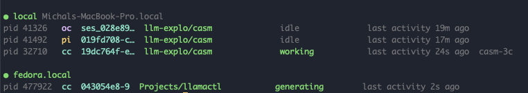

# casm

**Simple multi-node coding-agent session manager (claude code / opencode / pi) over SSH.**

List, search, and resume sessions for **Claude Code** (`cc`), **opencode** (`oc`), and **pi** (`pi`) - on local machine or via SSH.
**Move sessions between machines over SSH** so you can continue them where you're working.
Sessions are agent-scoped: a session always moves to the *same* agent on the other machine, never across agents.



No npm dependencies. Node 18+. macOS and Linux.

## Install

**On every machine you want to manage** - casm talks to its own copy on the other end, so it has to be installed and on PATH everywhere.

```sh
npm i -g casm-cli        # installs the `casm` command
```

## Hosts

A host is just an **ssh target** - a name from your `~/.ssh/config`, or `user@host`. Usernames, ports, identity files and jump hosts belong in `~/.ssh/config`.

```sh
casm host add rig                # adds it, then checks ssh + casm on the far end
casm host add me@fedora.local
casm host list                   # every host: ready / no casm / unreachable
casm host rm rig
```

That maintains a plain list in `~/.config/casm/config.json`:

```json
{ "hosts": ["rig", "me@fedora.local"] }
```

## Usage

```sh
casm continue                  # pick from your 10 most recent local sessions, resume it
casm search "oculink"          # full-text search across agents and machines
casm resume 019e4ee3           # resume by id, cd into the session directory and resume in appropriate coding agent
casm active                    # list currently active sessions from all nodes
casm list -n 30                # newest sessions across all agents and machines
casm list --agent opencode     # one agent only
casm show ses_110bdd           # preview a session, here or on any host (agent auto-detected)
casm host list                 # configured hosts + their reachability
```

## Bookmarks

Pin the sessions you intend to come back to:

```sh
casm bookmark 19dc764f casm-work   # bookmark with an alias (casm bm works too)
casm bookmark fc1cbe91             # bookmark without one
casm bookmark                      # list bookmarks
casm bookmark rm casm-work         # unpin (the session itself is untouched)
```

Bookmarked sessions are pinned to the top of `casm continue` with a `★`, and an
alias works anywhere an id-prefix does: `casm resume casm-work`,
`casm show casm-work`, `casm push casm-work fedora`. Stored in
`~/.config/casm/config.json` next to `hosts`; bookmarks are per-machine and
refer to local sessions.

## `push` and `pull`

Casm allows easy copying sessions between nodes. This doesn't cover cross-agent migrations, Claude Code session can be moved to other machine to continue with Claude Code there.

When running `push session_id` casm will check if the project path existing on the remote box and will give you options:

1. Push into the exact matching path, if it exists there
2. Push into a directory of the same name found elsewhere on the target
3. Rsync the whole local project directory over first, then push
4. A custom remote path, created if missing

```sh
casm push c66fbd0b fedora      # interactive move to another machine
casm push ses_110bdd fedora --to /home/user/proj   # non-interactive
casm pull fedora               # list what is on fedora
casm pull fedora c66fbd0b      # fetch that session here (any agent)
```

Pushed and pulled sessions keep the original session ID. That means a
transferred session exists on both machines under the same id, and the two
copies drift apart the moment you work on either one - there is no ongoing sync.

- `casm show <id>` prints the copy it found plus a `also on <host> - last
  activity 3.1h ago` line for every other machine holding that id, so you can
  tell which copy is ahead.
- `push`/`pull` refuse to transfer on top of an existing copy; `--force` to overwrite.

## `continue`

`casm continue` lists your 10 most recent local sessions across all three
agents, newest first, with age / agent / project / first message. Pick a number
(enter takes the newest, `q` aborts) and casm chdirs into that session's own
directory and hands the terminal to its agent.

It resumes the session **by id** (`claude --resume <id>`, `opencode -s <id>`,
`pi --session <id>`). If the original directory is
gone it warns and starts in the current one.

## How push works

One SSH probe reports whether the session's project path exists on the target
(local home mapped to remote home), plus any same-name directories elsewhere;
then a menu offers: push into the exact path / a found directory / rsync the
whole local project dir first / a custom path. After the move it prints the
resume command (e.g. `cd … && claude --resume <id>`) you can easily paste in your remote SSH.

Per-agent transfer mechanics:

| Agent | Session storage | Move mechanism |
|---|---|---|
| claude | `~/.claude/projects/<path-slug>/<uuid>.jsonl` (+ `<uuid>/` companion dir) | file copy into matching slug dir |
| pi | `~/.pi/agent/sessions/<path-slug>/<ts>_<uuid>.jsonl` | file copy into matching slug dir |
| opencode | sqlite (`~/.local/share/opencode/opencode.db`) | `opencode export` → rewrite `directory` → `opencode import` on remote |

Except project path session files and data are otherwise not modified, including session ID.

## Session status matching

Claude code records every active session at `~/.claude/sessions/<pid>.json`
(`sessionId`, `cwd`, `status`, `name`, `updatedAt`). casm reads it for session matching.
Anything else - opencode, pi, and claude versions with no `sessions/` directory
- is matched by process cwd and read from the newest transcript there, which is
best effort: two sessions of the same agent in one directory both resolve to
whichever transcript was written last, so one of them is misreported.

`casm active` prints one status per running agent process:

- **working** - the transcript ends on a user message written less than 5 minutes ago.
- **generating** - the transcript was written to in the last 10 seconds.
- **running tool** - the transcript ends on a pending `tool_use` and the agent process has children.
- **waiting approval?** - the transcript ends on a pending `tool_use` and the
  process has no children, i.e. it is sitting on a permission prompt.
- **stalled?** - the transcript ends on a user message 5 minutes old or more.
- **idle** - the transcript ends on an assistant message with nothing pending,
  or holds no messages at all; or opencode/pi have not written for 10 seconds.

`generating` is tested first, so the states below it only appear once the
transcript has been quiet for 10 seconds: a permission prompt reads as
`generating` for its first 10 seconds, then flips to `waiting approval?`.

A claude session that has been started but not yet talked to has no transcript
to read, and only there does casm fall back to claude's own `status` (`busy`
shown as `working`) until the first message lands.

Other meta values:

- **none** - no agent processes running on that machine.
- **unknown cwd** - the process is running but its directory could not be read.
- **no session found** - the directory is known, but no transcript there matches.

## Requirements & caveats

- Every managed machine needs casm on PATH (`npm i -g casm-cli`, so node ≥18)
  plus ssh and rsync.
- opencode push/pull additionally needs the `opencode` binary on both ends.
- opencode listing/search needs the `sqlite3` CLI (`dnf/brew install sqlite`).
- opencode `export` is captured via file redirect - its piped stdout
  truncates (bun stdout flush bug).
- Transcript formats are internal to each agent and may change between
  versions; parsing is defensive (bad lines skipped) but may degrade.
- Old tool results inside a moved conversation still reference source-machine
  paths; agents handle that fine going forward.

## Alternatives

`claude --cloud` / `claude teleport` (official, relays via claude.ai);
[agent-sessions](https://github.com/vineethkrishnan/agent-sessions) and
similar local TUI browsers (multi-agent but single-machine, no migration).
